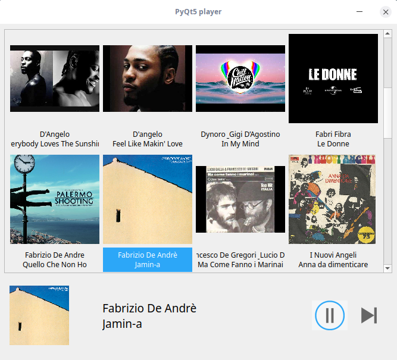

# PyQt5player

Browse and play your MP3s in a scroll area by cover artworks and titles. Basic controls, PLAY/PAUSE/SKIP, are provided.
I’ m just a hobbyist. In this project I have experimented with :
* creating widgets dinamically and adding them to a scroll area;
* managing QButtonGroup.



### Prerequisites
* Python 3.5+
* PyQt5
* Install python3-mutagen, in order to extract meta data form MP3s.
```
sudo apt-get update
sudo apt-get install python3-mutagen
```

* I have created two python codes.  The first one, named player.py, uses mplayer as a back-end application executed in a subprocess:
```
sudo apt-get install mplayer
```
* The second one, named playerpg.py, for mp3s playback uses pygame.mixer.music module. In order to install pygame library for python3, see https://www.pygame.org/wiki/GettingStarted#Debian/Ubuntu/Mint. For Debian/Ubunt enter the command:
```
sudo apt-get install python3-pygame
```
### Usage
In config,py set relative path, relative to your home directory, of the directory containing your MP3s collection. Examples:
```
mp3dir = "/myplaylist/"
mp3dir = "Music/myplaylist/"
```
Cd the working directory. Make player.py executable. Run with :
```
./player.py 
or
./playerpg.py
```
