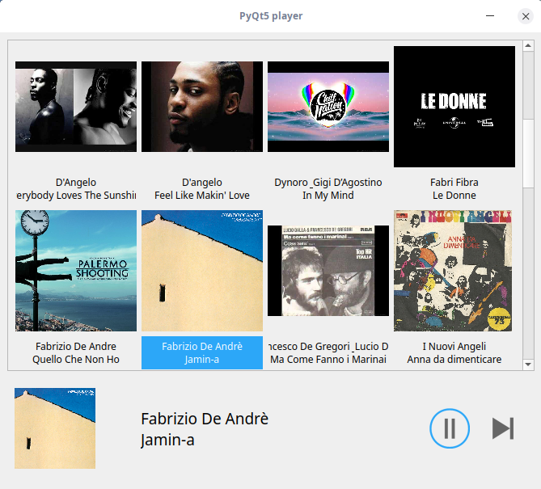

# PyQt5player

Browse and play your MP3s in a scroll area by cover artworks and titles. Basic controls, PLAY/PAUSE/SKIP, are provided.
I’ m just a hobbyist. In this project I have experimented with :
* creating widgets dinamically and adding them to a scroll area;
* managing QButtonGroup.



### Prerequisites
* Python 3.5+
* PyQt5
* This project use mplayer as a back-end application executed in a subprocess:
```
sudo apt-get install mplayer
```
* Install python3-mutagen, in order to extract meta data form MP3s.
```
sudo apt-get update
sudo apt-get install python3-mutagen
```
### Usage
In config,py set relative path, relative to your home directory, of the directory containing your MP3s collection. Examples:
```
mp3dir = "/myplaylist/"
mp3dir = "Music/myplaylist/"
```
Cd the working directory. Make player.py executable. Run with :
```
./player.py
```
